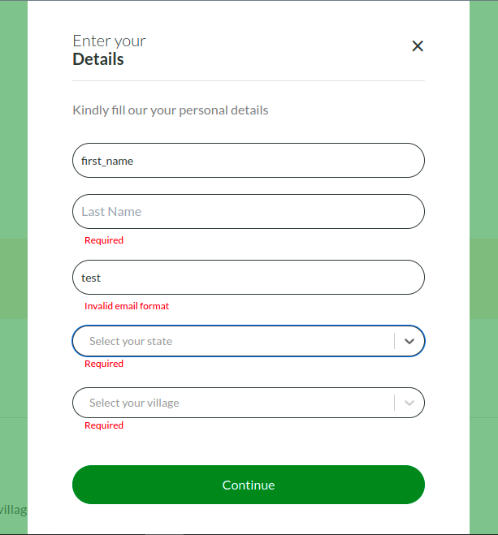

<h1 align="center">Reusable Form Component</h1>

<p align="center">
  
</p>

<p align="center">
  Multiple form control elements: input, textarea, select and radio.
</p>

#### Libraries Used

- [Formik](https://formik.org/)
- [React Select](https://react-select.com/home)
- [Yup](https://www.npmjs.com/package/yup)

##

## Usage/Examples

```bash
  npx create-react-app <my-app> --template typescript

  npm install formik yup react-select
```

Check out the [create-react-app](https://create-react-app.dev/docs/adding-typescript/) docs
for more information on how to add typescript to an existing project.

### Examples

```typescript
import { Form, Formik } from "formik";
import FormikControl from "../Forms/FormikControl";
import * as Yup from "yup";

const Login = () => {
  const validationSchema = Yup.object({
    username: Yup.string().required("Username is required"),
    password: Yup.string().required("Password is required"),
  });

  return (
    <Formik
      initialValues={{ username: "", password: "" }}
      validationSchema={validationSchema}
      onSubmit={(values) => console.log(values)}
    >
      {({ values }) => (
        <Form>
          <FormikControl
            values={values}
            control="input"
            placeholder="Enter Your Username"
            name="username"
            type="text"
          />
          <FormikControl
            values={values}
            control="input"
            placeholder="Password"
            name="password"
            type="password"
          />
          <button type="submit">Login</button>
        </Form>
      )}
    </Formik>
  );
};
```

### FormikControl attributes

```typescript
<FormikControl
  values={defaultValues}
  control="input"
  placeholder="Enter Your Username"
  name="username"
  type="text"
  options={selectOptions}
/>
```

Default values from the Formik component, passed down as props down to the form input type.

```typescript
values = { values }; //required
```

The type of form input rendered, can be input, textarea, select, or radio.

```typescript
control = "string"; //required
```

Placeholder text for the form input

```typescript
placeholder = "string";
```

Form input name. **_This must correspond with the name set in the initialValues object._**

```typescript
name = "string"; //required
```

Optional, defaults to "text" type...

```typescript
type = "string";
```

This is an array of the select options...
**_Only required for select controls._**

```typescript
options = { selectOptions }; //required

Example: const stateOptions = [
  {
    label: "Rivers State",
    value: "rivers",
  },
  {
    label: "Delta State",
    value: "delta",
  },
  {
    label: "Lagos State",
    value: "lagos",
  },
];
```

## !! Important

When using with **NextJS** server-side-rendering...

It looks like some components just can't be server rendered with some of the form components,
like the React-Select Form being used...
One way around this is to prevent serverside redering on the FormikControl Component.
To do this, simply change the way the component is imported.

Before...

```typescript
import FormikControl from "../Forms/FormikControl";
```

After...

```typescript
import dynamic from "next/dynamic";
const FormikControl = dynamic(() => import("../Forms/FormikControl"), {
  ssr: false,
});
```

If you ignore this, you'll get the generic Next.js **warning** that happens when the DOM in the client does not exactly match the DOM that was rendered on the server.
